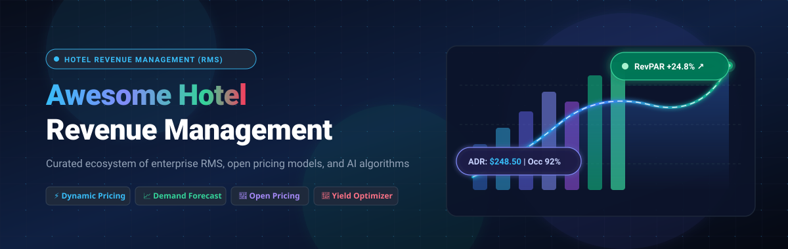

  

  
  
  
  
  
  
  

---

# 🏨 Awesome Revenue Management For Hotels

> **A comprehensive curated directory of commercial SaaS Revenue Management Systems (RMS), AI dynamic pricing software, demand forecasting models, open pricing engines, and open-source hospitality tools.**

Hotel Revenue Management (RMS) is the algorithmic science of selling the right room to the right guest at the right time for the right price across the right distribution channel. Modern hospitality revenue platforms empower hoteliers, resorts, multi-property portfolios, and boutique lodgings to automate price discovery, forecast market demand, manage inventory availability, and sustainably maximize **RevPAR** (Revenue Per Available Room), **ADR** (Average Daily Rate), and **GOPPAR** (Gross Operating Profit Per Available Room).

---

## 📑 Table of Contents

- [🌟 Sector Market Overview](#-sector-market-overview)
- [🏢 SaaS & Hosted Commercial Platforms](#-saas--hosted-commercial-platforms)
- [💻 Open-Source GitHub Projects](#-open-source-github-projects)
- [🧩 Key Functional Building Blocks of Hotel RMS](#-key-functional-building-blocks-of-hotel-rms)
- [📈 Star History](#-star-history)
- [🤝 How to Contribute](#-how-to-contribute)
- [⚖️ Disclaimer & Compliance](#️-disclaimer--compliance)

---

## 🌟 Sector Market Overview

> **Market Sizing & Structure**: The global Hotel Revenue Management System (RMS) software market is estimated at **$1.4 Billion to $2.2 Billion** (projected to expand at a compound annual growth rate of ~11.5% to exceed $4.5 Billion by 2032). The sector is **moderately fragmented**—dominated in luxury enterprise chains, gaming casinos, and large hotel conglomerates by heavyweight legacy suites (such as IDeaS and Duetto), while experiencing intense, agile competition across the mid-market, boutique, and independent property segments from cloud-native, AI-driven dynamic pricing challengers (including Lighthouse, Atomize, RoomPriceGenie, FLYR, Cloudbeds, and PriceLabs). It is not a winner-take-all monopoly due to wide variations in property tiering, tech-stack integration requirements (PMS, CRS, Channel Managers), and regional hospitality distribution models.

---

## 🏢 SaaS & Hosted Commercial Platforms

Below is an index of premier hotel revenue management systems, sorted in **descending order by Company Scale / Market Valuation / Annual Revenue**:

| Platform | Description | Company Scale / Valuation / Revenue 🏆 | Starting Tier Pricing 💵 | Free Tier / Free Trial Limits 🎁 |
| :--- | :--- | :--- | :--- | :--- |
| **[IDeaS](https://ideas.com/)** | Industry-standard enterprise hotel revenue management platform (G3 RMS, Optix, IPS) powering global chains, integrated resorts, and casino hotels with automated demand forecasting, continuous open pricing, and cluster optimization. | **~$10B+ Enterprise Valuation** (SAS Group; $3.2B+ Annual Revenue); ~$150M–$200M ARR division serving 30,000+ properties across 150+ countries | Starts at **$1,200/month** (~$8–$15/room/month; baseline enterprise contract ~$14,400/year; entry IDeaS Pricing System / IPS starts at ~$600/month) | **No open free trial or free tier**; 30-day proof-of-concept pilot with historical hotel PMS data analysis and guided sandbox simulation available upon sales qualification |
| **[Cloudbeds](https://www.cloudbeds.com/)** *(PIE)* | Cloud hospitality management platform with built-in Pricing Intelligence Engine (PIE) offering automated rule triggers, dynamic rate pushes, competitor comp-set tracking, and real-time market signals. | **~$1.0B+ Valuation (Unicorn)** ($250M+ funding from SoftBank Vision Fund 2 & EchoVC; ~$80M–$120M ARR; 20,000+ properties) | Starts at **$135/month** (Essentials package including PMS, channel manager, and core PIE dynamic pricing rules for properties up to 10 rooms) | **No open self-serve trial**; 14-day guided sandbox demo with simulated reservations and pricing automation rules available upon demo request |
| **[RateGain](https://rategain.com/)** *(Navigator / Rev-AI)* | Global travel and hospitality tech company providing AI-driven rate intelligence (Navigator), real-time OTA price tracking, automated parity monitoring, and demand forecasting. | **~$1.0B–$1.2B Market Cap** (NSE: RATEGAIN; ~$95M+ Annual Revenue; powering 3,200+ hotel clients and 700+ partners) | Starts at **$300/month** (or entry rate intelligence credit packages from $300/year; comprehensive enterprise RMS packages from ~$3,600/year) | **No permanent free tier**; 14-day guided proof-of-concept trial and sample competitive rate audit report available upon enterprise qualification |
| **[Lighthouse](https://www.mylighthouse.com/)** *(formerly OTA Insight)* | Commercial intelligence and automated pricing engine (Pricing Manager, Rate Insight, Market Insight) delivering dynamic rate recommendations, live competitor benchmarking, and flight search demand signals. | **~$500M–$700M Valuation** (Spectrum Equity backed; $80M+ funding; serving 65,000+ properties in 185+ countries) | Starts at **$100/month** (Pricing Manager starter plan from ~$100–$115/month; Rate Insight competitive intelligence starting at ~$89/month per property) | **14-day free trial** with full platform capabilities, real-time competitor rate shopping, comp-set benchmarks, and pricing recommendations (no credit card required) |
| **[Duetto](https://www.duetto.com/)** *(GameChanger)* | Cloud-native revenue strategy platform (GameChanger RMS, ScoreBoard BI, BlockBuster) renowned for Open Pricing—pricing room types, segments, and distribution channels independently in real time. | **~$400M–$600M Valuation** (Acquired by GrowthCurve Capital; previously $140M+ funding from Warburg Pincus; pricing 600,000+ hotel rooms) | Starts at **$1,000/month** (~$7–$15/room/month; typical annual contracts start at ~$12,000/year based on room count and property size) | **No open free trial or free tier**; evaluation provided via interactive sandbox demonstrations and guided 30-day proof-of-value (PoV) pilots with live PMS data |
| **[PriceLabs](https://pricelabs.co/)** | Algorithmic dynamic pricing and revenue management engine used by independent hotels, boutique accommodations, aparthotels, and serviced apartments for automated rate and min-stay optimization. | **~$350M–$500M Valuation** ($100M minority investment from Summit Partners in 2022; managing 350,000+ units across 135+ countries) | Starts at **$19.99/month** (flat fee for 1 listing/room, scaling to $9.99–$14.99/room/month for multi-room portfolios, or optional 1% revenue share) | **30-day free trial** with full feature access, market demand dashboard, automated rate calculations, and PMS integrations (no credit card required) |
| **[FLYR Hospitality](https://flyrhospitality.com/)** *(formerly Pace Revenue)* | Deep learning commercial intelligence and revenue management engine providing hourly continuous dynamic pricing, micro-forecasting, and automated inventory restrictions. | **~$350M–$500M Valuation** (Parent FLYR raised $300M+ from WestCap and BlackRock; $100M+ group ARR) | Starts at **€430/month** (~$470–$700/month, or €4.00–€13.00/room/month depending on property size and RMS tier) | **No open free trial or free tier**; 30-day proof-of-value evaluation and interactive sandbox environment populated with historical PMS booking feeds |
| **[RMS Cloud](https://www.rmscloud.com/)** | Enterprise PMS and revenue yield software delivering dynamic rate yielding, demand-driven inventory distribution, automated rate tiers, and multi-property controls. | **~$150M–$250M Valuation** (Established global hospitality vendor; ~$30M–$50M ARR; 7,000+ properties in 70+ countries) | Starts at **$55/month** (entry tier for small properties; scales with room count at ~$1.50–$3.00/room/month plus onboarding fee) | **No open free trial or free tier**; evaluation offered through personalized 1-on-1 guided sandbox demonstration and workflow assessment |
| **[BEONx](https://www.beonx.com/)** | Hospitality revenue optimization platform utilizing the Hotel Quality Index (HQI) to align pricing elasticity with online reputation, guest perception, and RevPAG (Revenue Per Available Guest). | **~$40M–$60M Valuation** (Backed by Adara Ventures & Axon Partners; ~$8M–$15M ARR; trusted by 2,000+ properties across 30+ countries) | Starts at **€688/month** (~$750/month for independent hotels; typical mid-market contracts range from €7,000–€15,000/year based on room inventory) | **No open free trial or free tier**; 14-day assisted simulation sandbox and parity audit using property historical data provided after demo consultation |
| **[Atomize](https://www.atomize.com/)** | Autonomous AI revenue management system delivering real-time continuous price optimization, real-time local demand sensing, and automated PMS rate publishing. | **~$30M–$50M Valuation** (Acquired by hospitality unicorn Mews in 2024; ~$5M–$10M ARR; properties across 50+ countries) | Starts at **€299/month** (~$325/month, or ~$4–$6/room/month for boutique and mid-market hotels up to 50 rooms) | **No open free trial or permanent free tier**; 14-day assisted simulation sandbox with property historical data and revenue uplift modeling upon sales demo |
| **[Wheelhouse](https://www.usewheelhouse.com/)** | Predictive pricing software engineered with customizable dynamic pricing algorithms (conservative, balanced, aggressive) and local market demand tracking for hotels and hybrid lodging. | **~$20M–$35M Valuation** (Highgate Technology Ventures backed; ~$4M–$8M ARR; pricing billions of dollars in gross room revenue) | Starts at **$19.99/month** per listing/room (Pro Flat plan) or **1% of booking revenue** (Performance plan, min $2.99/month per unit) | **14-day free trial** with full access to dynamic pricing algorithms, competitor rate tracking, and automated PMS rate synchronization (no credit card required) |
| **[RoomPriceGenie](https://www.roompricegenie.com/)** | Automated dynamic pricing solution purpose-built for independent hotels, boutique properties, and B&Bs without dedicated full-time revenue managers. | **~$15M–$25M Valuation** (Backed by Wingman Ventures; ~$3M–$6M ARR; chosen by 3,000+ independent hoteliers globally) | Starts at **$119/month** (Core plan billed annually, or $139/month billed monthly, for up to 10–20 rooms; scales with room count) | **14-day free trial** with full feature access, 2-way PMS integration, automated price recommendations, and free onboarding (no credit card required) |
| **[RevControl](https://www.revcontrol.com/)** | European cloud revenue management system featuring automated pickup tracking, competitor rate shopping, dynamic rate publishing, and multi-PMS integrations. | **~$10M–$18M Valuation** (Privately held European RMS specialist; ~$2M–$4M ARR) | Starts at **€195/month** (~$210/month for properties up to 20 rooms; plus €2.00–€3.00/additional room/month) | **30-day free trial** with full feature access, automated rate recommendations, PMS connection, and complimentary onboarding support |

---

## 💻 Open-Source GitHub Projects

Open-source hospitality software encompasses full-featured property management systems (PMS), central reservation systems (CRS), booking engines, dynamic pricing prototypes, and multi-agent AI revenue copilots.

The table below catalogs active open-source hospitality and revenue management projects, sorted in **descending order by GitHub_Stars ⭐**:

| Project & Repository | GitHub_Stars Badge | Primary Language | Description & Capabilities |
| :--- | :--- | :--- | :--- |
| **[Qloapps/QloApps](https://github.com/Qloapps/QloApps)** |  | PHP | The leading open-source hotel management and reservation system featuring integrated PMS, online booking engine, multi-currency support, tax management, and room rate controls. |
| **[Just-Moh-it/HotinGo](https://github.com/Just-Moh-it/HotinGo)** |  | Python | Modern MySQL and Python Tkinter-based hotel management system with automated room billing, guest ledger, and occupancy visualization. |
| **[JayVora-SerpentCS/OdooHotelManagementSystem](https://github.com/JayVora-SerpentCS/OdooHotelManagementSystem)** |  | Python / HTML | Comprehensive hotel ERP ecosystem built on top of Odoo, covering room reservation, seasonal folio management, restaurant POS, and revenue accounting. |
| **[SingletonSean/reservoom](https://github.com/SingletonSean/reservoom)** |  | C# | Desktop hotel reservation application demonstrating WPF MVVM architecture, conflict detection, reservation scheduling, and room inventory allocation. |
| **[onyxdevs/react-hotel-reservation-system](https://github.com/onyxdevs/react-hotel-reservation-system)** |  | TypeScript | Full-stack reactive hotel booking web application built with React.js, Redux Sagas, TypeScript, custom validation, and dynamic rate calculation flows. |
| **[MstfTurgut/hotel-reservation-system](https://github.com/MstfTurgut/hotel-reservation-system)** |  | Java | Modular monolith hotel management platform architected with Domain-Driven Design (DDD), CQRS, hexagonal ports/adapters, and event-driven booking state machines. |
| **[antonkarasbiz/QloApps_Full-stack_Booking](https://github.com/antonkarasbiz/QloApps_Full-stack_Booking)** |  | PHP | Full-stack deployment and customization suite for QloApps hotel PMS, incorporating booking engine hooks, channel management synchronization, and rate yielding. |
| **[ThimPressWP/wp-hotel-booking](https://github.com/ThimPressWP/wp-hotel-booking)** |  | PHP | WordPress hotel booking and reservation plugin managing room inventories, seasonal pricing plans, coupon codes, and payment gateways. |
| **[aws-samples/aws-dynamodb-enterprise-application](https://github.com/aws-samples/aws-dynamodb-enterprise-application)** |  | Go | AWS serverless enterprise Central Reservation System (CRS) implementation leveraging Amazon DynamoDB, AWS Lambda, and EventBridge for high-throughput hotel bookings. |
| **[im-ukr/SmartStay](https://github.com/im-ukr/SmartStay)** |  | Jupyter Notebook | Data-science hotel revenue project implementing dynamic room pricing algorithms, guest segment behavior modeling, and yield optimization strategies. |
| **[Syrian-Open-Source/Hotel-Management-System](https://github.com/Syrian-Open-Source/Hotel-Management-System)** |  | PHP | Web-based hotel management platform automating daily front-desk operations, room allocation, revenue reporting, and guest check-in/out workflows. |
| **[Ask29RBIH/hotel-automation-engine](https://github.com/Ask29RBIH/hotel-automation-engine)** |  | Python | Multi-agent autonomous AI system for hotel operations featuring a specialized Revenue Agent for automated dynamic pricing, demand forecasting, and yield management. |
| **[Moriyan1307/autumn-agentic-copilot](https://github.com/Moriyan1307/autumn-agentic-copilot)** |  | TypeScript | Multi-agent intelligent revenue management copilot utilizing LangChain/LangGraph, dynamic pricing routines, competitor rate scraping, and natural-language strategy configuration. |
| **[OssamaMokhtar/Avera-AI](https://github.com/OssamaMokhtar/Avera-AI)** |  | TypeScript | Autonomous hotel revenue management prototype engineered for GCC hospitality markets, optimizing RevPAR, ADR, and RevPASH across seasonal event cycles. |

---

## 🧩 Key Functional Building Blocks of Hotel RMS

Modern hotel revenue management architectures unify several critical technical layers:

1. **📊 Demand Forecasting Engines**: Time-series models (ARIMA, Prophet, LSTM) and machine learning regressors (XGBoost, LightGBM) trained on historical PMS booking velocity, on-the-books (OTB) pickup, cancellation rates, seasonality, and local market event calendars.
2. **🏷️ Open Pricing & Rate Independence**: Replacing static tiered BAR (Best Available Rate) structures with dynamic, unconstrained continuous pricing where every room type, customer segment, and channel is priced independently in real time based on demand elasticity.
3. **🌐 Rate Shopping & Parity Intelligence**: Automated headless web crawlers and API scrapers monitoring OTA channels (Expedia, Booking.com, Agoda, Trip.com) and metasearch engines (Google Hotel Ads, Trivago) to enforce rate parity and benchmark competitor comp-sets.
4. **🔄 Two-Way PMS & CRS Integrations**: Bidirectional webhook and REST/HTNG/OTA-compliant connectors syncing inventory, reservations, out-of-order rooms, and pushing optimized rate recommendations directly into Property Management Systems.
5. **🎯 Inventory Restrictions & Length-of-Stay (LOS) Controls**: Algorithmic rules applying Minimum Length of Stay (MLOS), Closed to Arrival (CTA), and overbooking thresholds to prevent shoulder-date occupancy cliffs during peak demand periods.

---

## 📈 Star History

---

## 🤝 How to Contribute

Contributions are welcome! Help expand this hospitality revenue resource:

1. 🍴 Fork the repository.
2. 📝 Add or update entries in `README.md` (maintain exact markdown formatting and factual citations).
3. 🔎 Ensure SaaS platforms include verified starting tier prices, enterprise valuation/scale, and explicit free tier / trial limits.
4. ⭐ Ensure open-source projects include star count social badges linking directly to their stargazers page.
5. 🚀 Submit a Pull Request with a concise summary of changes.

---

## ⚖️ Disclaimer & Compliance

- This repository is a **community-curated educational and informational resource**; inclusion does not constitute commercial endorsement.
- Hotel revenue management systems directly govern live rates, room distribution, and enterprise cash flow. Inaccurate models or unverified scraping tools can cause substantial financial damage or contractual disputes.
- Open-source pricing prototypes and research notebooks should be extensively backtested and validated with historical sandbox data before deployment into production hospitality environments. Hoteliers remain solely responsible for pricing compliance and regional consumer protection statutes.

---

  <b>Made with ❤️ for hotel revenue directors, general managers, hospitality technologists, and dynamic pricing researchers.</b>

